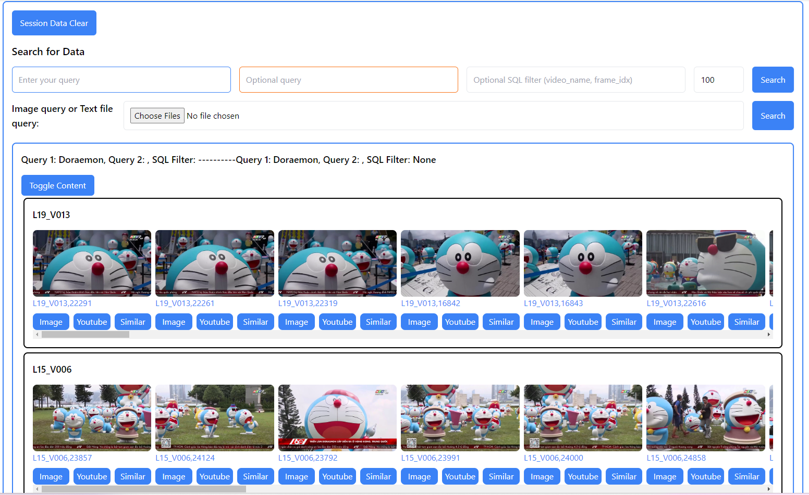

# AI challenge 2024

## Dataset

Videos from Hội thi Thử thách Trí tuệ Nhân tạo (AI-Challenge) TP.HCM.

## Details

Keyframes: scenedetect.
```bash
scenedetect -i 'videos/video_name.mp4' detect-adaptive save-images --filename 'keyframes/$VIDEO_NAME/image-$IMAGE_NUMBER-scene-$SCENE_NUMBER-frame-$FRAME_NUMBER'
```

Embeddings: OpenCLIP.

```python
open_clip.create_model_and_transforms('ViT-H-14-378-quickgelu', pretrained='dfn5b')
```

Database: LanceDB. Check patch14v2_openclip.py for more details.

User Interface web app: Flask.

